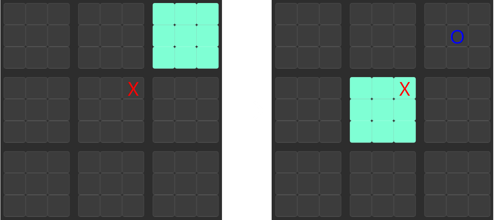
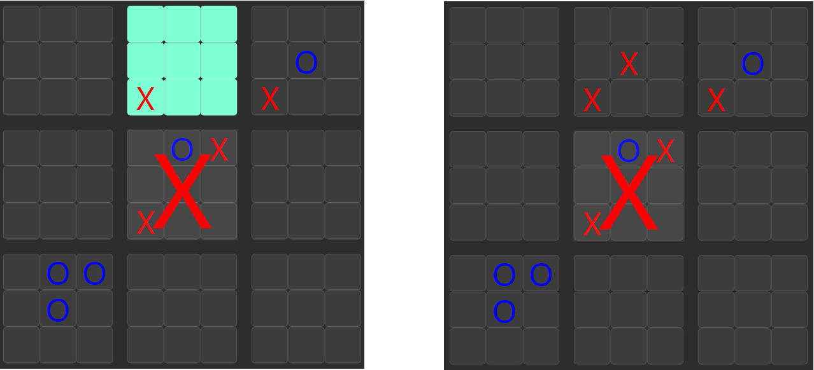
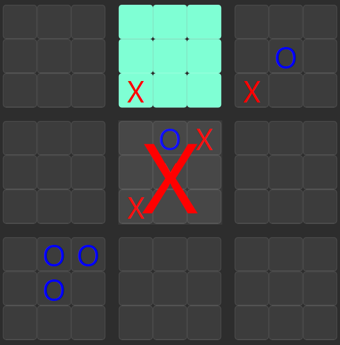

# Ultimate Tic-Tac-Toe

Remember that fun little game with noughts and crosses?\
Yeah it gets boring pretty quickly. So why not try something that goes on a bit longer, and needs some more strategic planning?

#### Table of Contents
- [:scroll:**The Rules**](#rules)
- [:computer:**Running the program**](#program-run)
- [:copyright:**Credits**](#credits)

---

## :scroll:The Rules
Just like the normal Tic-Tac-Toe game, you win if you have a three in a row. However, here you are going to play on a 9x9 grid. This grid is subdivided into 3 smaller boards.
1. The first move can be made on any of the 81 squares in the grid. Following that, the next move has to be made in the small board with the corresponding position to the position made in the previous small board.

    

        <b>Illutstrative Example</b>
    

    

        
        

            <b>
                X moved in the middle board at row 3, column 3. After that, O has to make a move in the small board at row 3, column 3
            </b>
        

    

2. If one player is able to make three in a row on a small board, a both player has filled the small board (a tie), the board is then no longer playable. When a player makes a move that send the next player to the aforementioned board, the next player can instead make a move in any other board.

    

        <b>Illutstrative Example</b>
    

    

        
        

            <b>
                Here X is to play in the top middle board, X decides to play at the middle cell. In turn, O then has to play in the center small board. Since that board has been won, O can now play in any other board
            </b>
        

    

3. The players continue playing following the above rules until one has won three small boards in a row or they have filled out the entire grid.

    

        <b>Illutstrative Example</b>
    

    

        
        

            <b>
                X has won three boards in a row (three boards in the middle column). X now wins the game
            </b>
        

    

---

## :computer:How do I run the program?
### Running as an executable:
To run the program from an executable, download the zip file and unzip them. Depending on your system, refer to:
1. [`dist/UTTT_windows_32bit.zip`](./dist/UTTT_windows_32bit.zip)
### Running from Python script:
To run from the main Python script `src/ultimate_tictactoe.py`. Follow these steps:
1. Before running, be sure to have [Python](https://www.python.org/) installed, Python 3.12 is highly recommended, 3.10 is minimal.
2. Afterwards, install libraries in `/requirements.txt` using `pip install -r path/to/requirements.txt` or any other means. For more infomation, visit [pip install](https://pip.pypa.io/en/stable/cli/pip_install/#description).
2. If everything has been setup correctly, you can now run `src/ultimate_tictactoe.py` as is.

---
---

## :copyright:Credits
Special thanks to [Gabriel-Duong](https://github.com/Gabriel-Duong) for creating the loading gif as well as testing out the application!
The cogwheel and hamburger icons are taken from [FlatIcon](https://www.flaticon.com/)